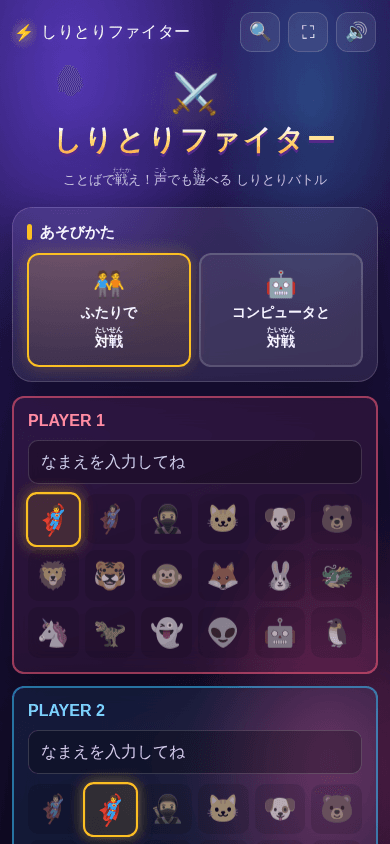
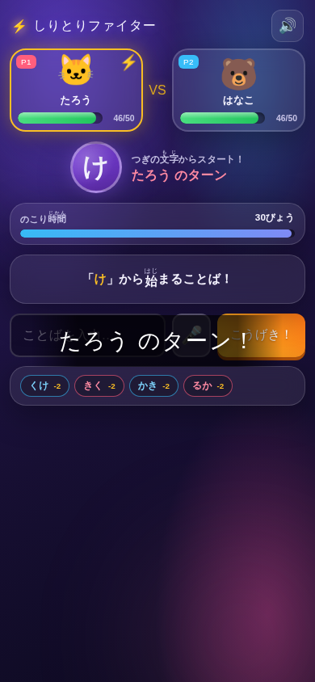

# ⚡ しりとりファイター

ことばで戦う **しりとり対戦Webアプリ** です。小学生が休み時間に楽しみながら語彙力や瞬発力を養うことを目的としています。
ふたりでの対戦、コンピュータとのひとり対戦、マイクを使った音声入力に対応しています。

ビルド不要・依存ライブラリなし。静的ファイルを置くだけで動きます（サーバーもデータベースも使いません）。

| セットアップ画面 | バトル画面 |
|:--:|:--:|
|  |  |

> 画面の見方・ボタンの意味・トラブル対処まで載せた詳しい手引きは **[操作マニュアル（MANUAL.md）](MANUAL.md)** にあります。

## このアプリでできること

| できること | 内容 |
|---|---|
| ふたりで対戦 | 1台の端末を交代で使い、名前とキャラクター（絵文字18種）を選んで対戦します。 |
| コンピュータと対戦 | ひとりでも遊べます。強さは **やさしい / ふつう / つよい** の3段階。 |
| 音声入力 🎤 | マイクボタンを押して話すだけで言葉を入力できます。文字入力が苦手な低学年でも遊べます。 |
| かな自動変換 | ひらがな・カタカナ・ローマ字のどれで打っても、自動でひらがなに直して判定します。 |
| バトル設定 | たいりょく（HP）**30 / 50 / 100**、こたえる時間 **10 / 20 / 30秒** から選べます。 |
| ゲームらしい演出 | 効果音、ダメージポップアップ、画面シェイク、ヒットエフェクト、ターン開始バナー、紙吹雪。効果音は🔊ボタンでいつでもON/OFFできます。 |
| リザルト表示 | 決着後に「つかったことば（両者の合計）」「さいだいダメージ（言葉つき）」「バトル時間」を表示します。 |
| PWA対応 | 静的ホスティング時のみ。ホーム画面にインストールでき、一度読み込めばオフラインでも遊べます。 |
| 端末を選ばない | スマートフォン・タブレット・Chromebook・PCの縦横どちらの画面にも合わせて配置が変わります。 |

### できないこと（あらかじめご確認ください）

- **言葉が実在するかどうかは判定しません。** ひらがな・カタカナ・ローマ字であれば受け付けます。造語かどうかは遊ぶ人同士（または先生）のジャッジにおまかせする設計です。
- **スコアや対戦成績は保存しません。** 端末に保存されるのは効果音のON/OFF設定だけです。名前や言葉がサーバーへ送られることもありません（音声入力時を除く。→[MANUAL.md の「音声入力とプライバシー」](MANUAL.md#音声入力とプライバシー)）。
- **オンライン対戦はできません。** 対戦は同じ1台の端末で行います。

## ルール

1. 画面中央に表示された文字から始まる言葉を、制限時間内に入力（または音声で発言）します。最初の1文字は「あ」〜「わ」の清音44文字（「を」「ん」を除く）からランダムに選ばれます。
2. 言葉を出せたら相手に **「文字数 ＋ ボーナス」ぶんのダメージ** を与えます。拗音（ゃ・ゅ・ょ）と長音（ー）は1つにつき **+2** のボーナスです。
   - 例）`りんご` → 3ダメージ ／ `しゃぼんだま` → 6+2 = **8ダメージ** ／ `ちょこれーと` → 6+2+2 = **10ダメージ**
3. 時間切れになると **自分が5ダメージ** を受け、次の文字は変わらないまま相手のターンになります。
4. **「ん」で終わる言葉を言ったら即負け。** 一度使われた言葉は、どちらのプレイヤーも二度は使えません。
5. 次の文字は、その言葉の最後の1文字です。末尾の長音（ー）は読み飛ばし、小さい文字は大きい文字に直します（`らっこ`→「こ」、`ちーず`→「す」、`きんぎょ`→「よ」）。
6. 先に相手のHPを0にした方の勝ちです。コンピュータが言葉を思いつけずに降参した場合もプレイヤーの勝ちになります。

## 使い方（プレイの流れ）

1. **モードを選ぶ**: 「ふたりで対戦」か「コンピュータと対戦」を選びます。
2. **セットアップ**: 名前（10文字まで）とキャラクターを選び、HPと制限時間を決めて「バトルスタート！」。コンピュータ対戦のときは、代わりに強さを選びます。
3. **バトル**: 画面中央の文字から始まる言葉を入力して「こうげき！」。🎤 ボタンを押すと声で入力できます（初回はマイクの許可が必要です）。
4. **リザルト**: 「もういちど！」で同じ設定のまま再戦、「せっていにもどる」で設定画面に戻ります。

各画面の詳しい説明とトラブル対処は **[MANUAL.md](MANUAL.md)** を参照してください。

## 動作環境

| 項目 | 対応状況 |
|---|---|
| ブラウザ | Chrome / Edge / Safari / Firefox の最新版 |
| 音声入力 🎤 | Web Speech API 対応ブラウザのみ（Chrome・Edge など）。**インターネット接続が必要**です。非対応ブラウザではマイクボタン自体が表示されません。 |
| PWAインストール・オフライン動作 | GitHub Pages などの **https の静的ホスティング**（または localhost）で有効。 |
| ネットワーク | 初回読み込み後はオフラインでも遊べます（Webフォントはオフライン時、端末のフォントに自動で切り替わります）。 |

## 公開（デプロイ）方法

### GitHub Pages

1. リポジトリの **Settings > Pages** を開き、「Source」を `Deploy from a branch`、ブランチを `main`、フォルダを `/ (root)` に設定して保存します。
2. 数分後に `https://<ユーザー名>.github.io/Shiritori_fighter/` で公開されます。
3. Chrome で開くと、アドレスバーのインストールアイコン、またはヘッダーの「📲 インストール」ボタンから
   アプリとしてインストールできます（このボタンは、ブラウザがインストール可能と判断したときだけ出ます）。
   - Android / Chrome … メニューから「ホーム画面に追加」
   - iPhone / iPad（Safari）… 共有メニューから「ホーム画面に追加」

> **⚠️ 置き場所は `/Shiritori_fighter/` 固定です。**
> `gigayama.github.io` は数十個のアプリが同じオリジンを共有しています。
> どのアプリかを取り違えないよう、`manifest.webmanifest` の `id` / `scope` / `start_url` と
> `index.html` の読み込みパスを、すべてリポジトリ名からの絶対パスにしてあります。
> 別の名前のリポジトリにコピーして使うときは、**この3つとパスを最初に書き換えてください。**
> 書き換えないと、すでにインストール済みの端末で「開いたら違うアプリが立ち上がる」事故が起きます。

### 手元で動かす

絶対パスを使っているため、`index.html` をダブルクリックして `file://` で開くことはできません。
リポジトリの**親フォルダ**を配ってください。

```bash
cd ..                       # Shiritori_fighter の1つ上
npx http-server -p 8080     # または python3 -m http.server 8080
# → http://localhost:8080/Shiritori_fighter/
```

Service Worker は https か localhost でしか登録されません（ブラウザの仕様）。

### リリースするとき（必ず読んでください）

**`sw.js` の `APP_VERSION` を上げてから push してください。**
上げ忘れると、児童の端末で古い画面が表示されたままになります。

```javascript
const APP_VERSION = 'v1.1.0';   // ← ここを上げる
```

版を上げると、次に開いた児童の画面に「あたらしい ばんが あります／さいしんに する」が出ます。
**押されるまで中身は入れ替わりません**（対戦の途中で画面が切り替わって、打ちかけのことばが消えるのを防ぐため）。

## ファイル構成

| ファイル | 役割 |
|---|---|
| `index.html` | 画面の骨組みだけ。CSS も JavaScript も含みません。 |
| `css/style.css` | 見た目。デザイントークン・提示モード・印刷以外の表示すべて。 |
| `js/kana.js` | かな変換（ローマ字・カタカナ→ひらがな、次の文字の決定）。テストの対象。 |
| `js/app.js` | ゲーム本体（進行・CPU・効果音・演出・音声入力・更新の案内）。 |
| `install-hook.js` | インストールの合図を `<head>` の先頭で受け取る小さなファイル。 |
| `manifest.webmanifest` | PWA の定義。`id` / `scope` / `start_url` は絶対パス。 |
| `sw.js` | Service Worker。**自アプリのキャッシュだけ**を掃除します。 |
| `offline.html` | 圏外でアプリ本体も手元に無いときに出る画面。外部資産にも JS にも頼りません。 |
| `icons/` | ホーム画面用アイコン（通常・マスカブル・Apple用）。 |
| `scripts/`, `tests/`, `quality.config.json` | 品質ゲートとテスト。 |
| `docs/` | README に載せているスクリーンショット。 |
| `AUDIT.md` | 実測値の記録。**測っていないものも書いてあります。** |

**CSP（`index.html` の `Content-Security-Policy`）を入れているため、
インラインの `<script>` と `onclick=` は動きません。**
機能を足すときは、外部ファイルと `addEventListener` で書いてください。
`npm run check` がこれを検査します。

## 開発

依存パッケージはありません。Node.js 22 以上があれば動きます。

```bash
npm run check   # 品質ゲート（CI と同じもの）
npm test        # かな変換のテスト＋品質ゲート自身の自己テスト
```

`npm test` は、**わざと壊した複製を作って検査が落ちることを1件ずつ確かめます。**
「0件でした」だけでは、検査が動いているのか何も見ていないのか区別できないためです。

## 技術メモ

- 依存ライブラリなし・ビルド不要です。CDN から実行コードを読み込む箇所は **0バイト** です（学校のフィルタリングで CDN が塞がれても起動します）。
- 唯一の外部リソースはGoogle Fonts（M PLUS Rounded 1c / DotGothic16）です。読み込めない場合はシステムフォントにフォールバックするため、オフラインでも表示は崩れません。
- かな変換（カタカナ→ひらがな、ローマ字→ひらがな）は内蔵の変換器で行うため、オフラインでも動作します。
- 効果音はWebAudio APIでリアルタイム合成しており、音声ファイルを持ちません。ミュート設定は `localStorage`（キー `sf-muted`）にのみ保存されます。
- 音声入力はWeb Speech API（`SpeechRecognition`、`lang: ja-JP`）を使用します。認識候補を最大5件受け取り、しりとりの条件に合うものを優先して採用します。
- コンピュータ対戦は `js/app.js` 内に持つ約330語の辞書（小学生向けの一般名詞・「ん」で終わる語なし）から言葉を選びます。候補が尽きると降参します。
- Service Workerは自アプリ（`shiritori-` 接頭辞）のキャッシュだけを削除します。同一オリジンに他のアプリを置いている場合でも巻き添えにしません。
- `prefers-reduced-motion` を尊重し、アニメーションと紙吹雪・パーティクル演出を抑えた表示に自動で切り替わります。
  停止時間は `0` ではなく `.01ms` です（`0` にすると `animation-fill-mode: forwards` が壊れ、要素が消えます）。
- ハイコントラストモード（`forced-colors`）では、背景色が無効化されてもボタンの輪郭が残ります。
- 電子黒板向けの**提示モード**（🔍）と**全画面**（⛶）をヘッダーに用意しています。
- 表示の実測値（コントラスト比・タップ領域・PWA の挙動）は **[AUDIT.md](AUDIT.md)** にあります。

## ライセンス

MIT License / Copyright (c) 2026 GIGAyama — [LICENSE](LICENSE)
</content>
